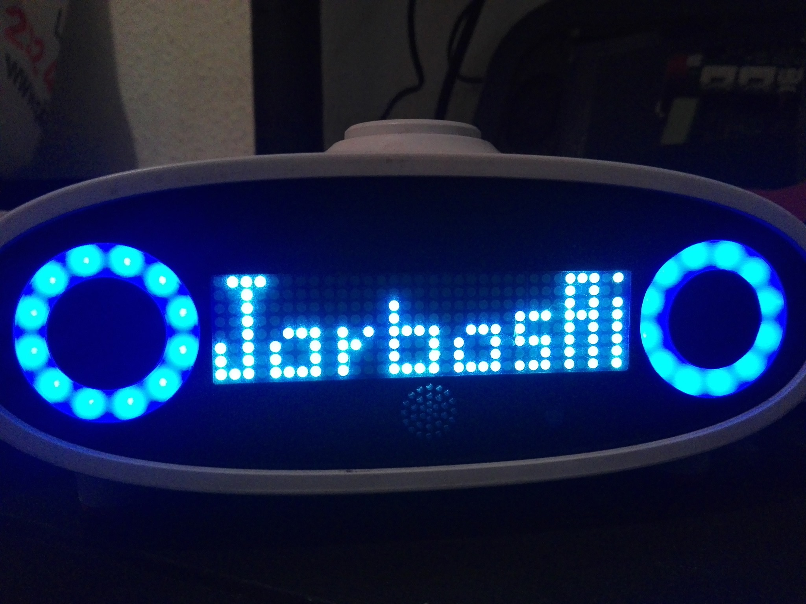

# OVOS Mark1 Client

This library controls the faceplate and eyes of the Mycroft Mark 1 hardware enclosure. It sends commands over the [OVOS messagebus](https://openvoiceos.github.io/message_spec/phal_mk1/) and gives you pixel-by-pixel control of the 32x8 mouth display and the eye ring.



## Install

```bash
pip install ovos-mark1-utils
```

## Usage

Draw a custom icon on the mouth display.

```python
from ovos_mark1.faceplate import BlackScreen
class MusicIcon(BlackScreen):
    str_grid = """
XXXXXXXXXXXXXXXXXXXXXXXXXXXXXXXX
XXXXXXXXXXXXXX     XXXXXXXXXXXXX
XXXXXXXXXXXXXX     XXXXXXXXXXXXX
XXXXXXXXXXXXXX XXX XXXXXXXXXXXXX
XXXXXXXXXXXXXX XXX XXXXXXXXXXXXX
XXXXXXXXXXXXX  XX  XXXXXXXXXXXXX
XXXXXXXXXXXX   X   XXXXXXXXXXXXX
XXXXXXXXXXXXX XXX XXXXXXXXXXXXXX
"""

icon = MusicIcon()
icon.print()  # show in terminal
icon.display()  # show in mark1
```

Animate the eyes.

```python
from ovos_mark1.eyes import Eyes
from ovos_bus_client.util import get_mycroft_bus

bus = get_mycroft_bus("0.0.0.0")

eyes = Eyes(bus)
eyes.hue_spin()
```

Build your own faceplate animation. Subclass `FacePlateAnimation` and define an `animate()` method that runs on each frame.

```python
# it's snowing !
class FallingDots(FacePlateAnimation):
    def __init__(self, n=10, bus=None):
        super().__init__(bus=bus)
        self._create = True
        assert 0 < n < 32
        self.n = n

    @property
    def n_dots(self):
        n = 0
        for y in range(self.height):
            for x in range(self.width):
                if self.grid[y][x]:
                    n += 1
        return n

    def animate(self):
        self.move_down()
        if self._create:
            if random.choice([True, False]):
                self._create = False
                x = random.randint(0, self.width - 1)
                self.grid[0][x] = 1
        if self.n_dots < self.n:
            self._create = True
```

Use a prebuilt animation.

```python
from ovos_mark1.faceplate.animations import ParticleBox
from ovos_utils.messagebus import get_mycroft_bus
from time import sleep

bus = get_mycroft_bus("0.0.0.0")

for faceplate in ParticleBox(bus=bus):
    faceplate.display(invert=False)
    sleep(0.5)


from ovos_mark1.faceplate.cellular_automaton import Rule110

a = Rule110(bus=bus)

for grid in a:
    grid.print()  # animate in terminal
    grid.display(invert=False)
    sleep(0.5)
```

## Related projects

- [OpenVoiceOS/ovos-PHAL-plugin-mk1](https://github.com/OpenVoiceOS/ovos-PHAL-plugin-mk1): the PHAL plugin that receives the messagebus events this library sends and drives the Mark 1 enclosure hardware.

## License

Apache License 2.0. See [LICENSE](./LICENSE).
