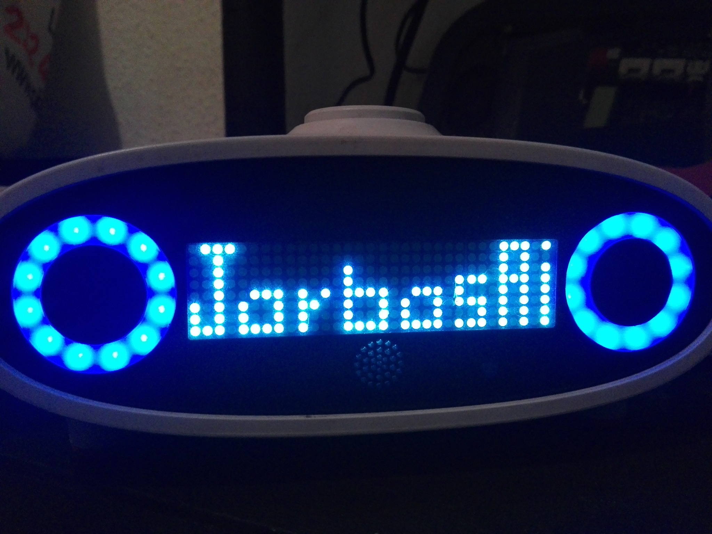

# OVOS Mark1 Client

small library to interact with a [Mycroft Mark1 faceplate via the messagebus](https://openvoiceos.github.io/message_spec/phal_mk1/)

gives you full control of the faceplate and eyes pixel by pixel



## Usage

drawing in python

```python
from ovos_mark1.faceplate import BlackScreen

class MusicIcon(BlackScreen):
    str_grid = """
XXXXXXXXXXXXXXXXXXXXXXXXXXXXXXXX
XXXXXXXXXXXXXX     XXXXXXXXXXXXX
XXXXXXXXXXXXXX     XXXXXXXXXXXXX
XXXXXXXXXXXXXX XXX XXXXXXXXXXXXX
XXXXXXXXXXXXXX XXX XXXXXXXXXXXXX
XXXXXXXXXXXXX  XX  XXXXXXXXXXXXX
XXXXXXXXXXXX   X   XXXXXXXXXXXXX
XXXXXXXXXXXXX XXX XXXXXXXXXXXXXX
"""
    
icon = MusicIcon()
icon.print()  # show in terminal
icon.display()  # show in mark1
```

Pre made animations

```python
from ovos_mark1.faceplate.animations import ParticleBox
from ovos_utils.messagebus import get_mycroft_bus
from time import sleep

bus = get_mycroft_bus("0.0.0.0")

for faceplate in ParticleBox(bus=bus):
    faceplate.display(invert=False)
    sleep(0.5)

    
from ovos_mark1.faceplate.cellular_automaton import Rule110

a = Rule110(bus=bus)

for grid in a:
    grid.print()  # animate in terminal
    grid.display(invert=False)
    sleep(0.5)
```

Animate the eyes

```python
from ovos_mark1.eyes import Eyes
from ovos_utils.messagebus import get_mycroft_bus

bus = get_mycroft_bus("0.0.0.0")

eyes = Eyes(bus)
eyes.hue_spin()
```
